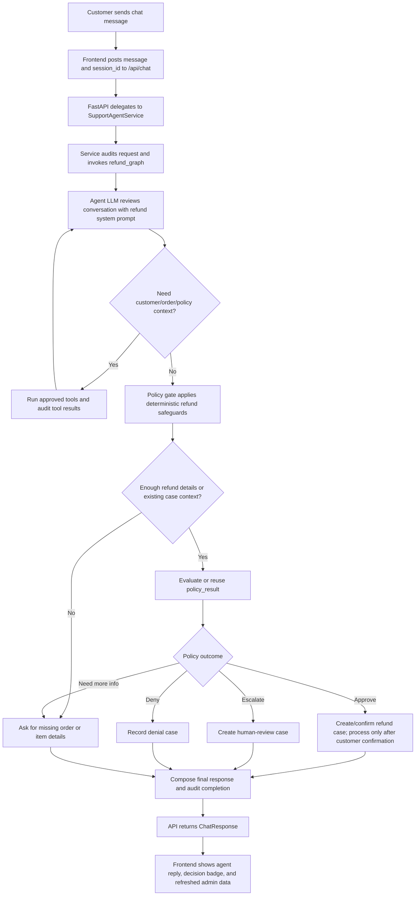

# Chat Agent Response Flow

This visual aid explains how the customer-support chat agent turns a customer message into the response shown in the app. It follows the path from the React chat composer, through the FastAPI endpoint and LangGraph refund workflow, to the final response and admin audit records.

## Crucial chat-flow nodes

| # | Node | Responsibility |
|---:|---|---|
| 1 | Customer sends chat message | The customer enters a refund request or follow-up in the chat UI. |
| 2 | Frontend posts to `/api/chat` | The React app sends the message with the current `session_id`, if one exists. |
| 3 | FastAPI and service handoff | The backend receives the request, starts or reuses the session, creates turn metadata, and records the intake audit event. |
| 4 | LangGraph agent node | The LLM reads the system prompt and conversation state, then either answers safely or requests approved tools for context. |
| 5 | Tool loop | Customer, order, policy, and refund-evaluation tools can run; each tool call is audited and useful outputs update graph state. |
| 6 | Policy gate | Deterministic code checks whether the turn is a new refund request, an existing-case follow-up, or a missing-information scenario. |
| 7 | Policy evaluation | The app evaluates or reuses a `policy_result` that drives the refund decision. |
| 8 | Case side effects | The graph records approval, escalation, denial, or needs-information state; approved refunds are processed only after customer confirmation and duplicate protection. |
| 9 | Final response | The backend composes the customer-facing reply, records final audit events, and returns the `ChatResponse`. |
| 10 | Frontend update | The UI appends the agent reply, updates the decision badge, and refreshes admin logs and refund cases. |

## Key control points

- **LLM-assisted, policy-gated:** The LLM can gather context with tools, but deterministic policy and case-routing code controls refund decisions and side effects.
- **Refunds require confirmation:** A new approval produces a confirmation request first; money is only processed after a qualifying follow-up confirmation.
- **Duplicate protection:** Confirmed refunds pass through duplicate-refund protection before the case is marked approved.
- **Auditable by design:** Request intake, LLM steps, tool calls, policy decisions, side effects, final responses, and turn completion are recorded for review.
