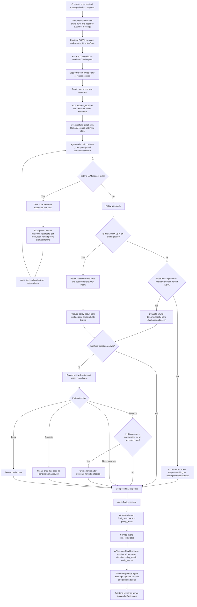

# Chat Agent Response Flow

This visual aid explains how the customer-support chat agent turns a customer message into the response shown in the app. It follows the path from the React chat composer, through the FastAPI endpoint and LangGraph refund workflow, to the final response and admin audit records.

## Node-by-node responsibilities

| # | Node | Responsibility |
|---:|---|---|
| 1 | Customer chat composer | Captures the customer's refund request or follow-up message. |
| 2 | Frontend validation | Ignores blank submissions and prevents duplicate sends while loading. |
| 3 | Optimistic customer message | Adds the customer's message to local chat state immediately. |
| 4 | `POST /api/chat` | Sends `message` and optional `session_id` to the backend. |
| 5 | FastAPI chat endpoint | Receives the request and delegates to the support agent service. |
| 6 | Session setup | Reuses the supplied session or creates a new `session-*` id. |
| 7 | Turn tracking | Creates a turn id and sequence so audit events can be grouped. |
| 8 | Request audit | Records `request_received` with redacted text, detected intent, and extracted order/item/email signals. |
| 9 | Graph initialization | Starts the LangGraph workflow with the human message and empty per-turn state. |
| 10 | Agent / LLM node | Calls the LLM with the refund system prompt and available tools. |
| 11 | Tool routing decision | Sends the graph to tools when the LLM requests tool calls; otherwise proceeds to the policy gate. |
| 12 | Tool execution | Runs customer, order, policy, or refund-evaluation tools and records each result. |
| 13 | Tool state extraction | Promotes useful tool outputs, such as customer id, order id, and policy result, into graph state. |
| 14 | Policy gate | Applies deterministic safeguards before any case action is taken. |
| 15 | Existing-case follow-up check | Detects gratitude, acceptance, dispute, human-review request, information request, or refund confirmation for the latest case. |
| 16 | Explicit refund target check | Looks for an order id and optional item ids in the latest customer message. |
| 17 | Deterministic policy evaluation | Evaluates refund eligibility from the database and refund policy. |
| 18 | Non-case response | Produces a safe clarification message when order/item details are missing. |
| 19 | Policy-result routing | Decides whether to record a case, create a refund, escalate, deny, or only compose a reply. |
| 20 | Case record upsert | Writes or updates a `RefundCase` with decision, status, amount, selected items, reason codes, and policy citations. |
| 21 | Approval branch | For a new approval, asks the customer to confirm details before processing money. |
| 22 | Confirmation branch | When the customer confirms an approved case, checks for duplicates and records the refund. |
| 23 | Escalation branch | Marks the case as pending human review when policy requires escalation or the customer asks for a human. |
| 24 | Denial branch | Records a denied case with policy reason codes and citations. |
| 25 | Final response composition | Builds the customer-facing response from decision, case id, amount, citations, and follow-up intent. |
| 26 | Final-response audit | Records the exact response, decision, and case id. |
| 27 | Turn completion audit | Records turn status, policy decision, case id, customer id, order id, and response. |
| 28 | Chat response payload | Returns the final message, session id, policy result, decision, and recent audit events. |
| 29 | Frontend response update | Appends the agent answer, stores the session id, and updates the decision badge. |
| 30 | Admin refresh | Refreshes audit logs and refund cases so operators can inspect what happened. |

## Key control points

- **LLM-assisted, policy-gated:** The LLM can gather context with tools, but deterministic policy and case-routing code controls refund decisions and side effects.
- **Refunds require confirmation:** A new approval produces a confirmation request first; money is only processed after a qualifying follow-up confirmation.
- **Duplicate protection:** Confirmed refunds pass through duplicate-refund protection before the case is marked approved.
- **Auditable by design:** Request intake, LLM steps, tool calls, policy decisions, side effects, final responses, and turn completion are recorded for review.
