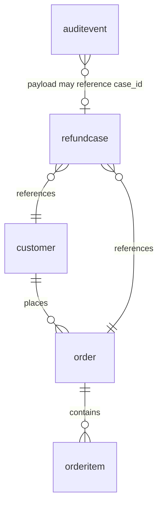

# Database Schema

This app uses a local SQLite database at:

```text
backend/support_agent.db
```

The database is created by `app.database.init_db()` and seeded from:

```text
backend/app/data/seed_customers.json
```

## Tables



## `customer`

Mock CRM customer profile table.

| Column | Type | Meaning |
|---|---|---|
| `id` | string, primary key | Customer id such as `CUST-1001`. |
| `name` | string | Customer display name. |
| `email` | string, unique/indexed | Customer email used for lookup. |
| `loyalty_tier` | string | Mock loyalty tier. |
| `refund_count_last_12_months` | integer | Used by policy escalation logic for orders linked to this customer. |
| `notes` | string | Support/CRM notes. |
| `created_at` | datetime | Row creation timestamp. |

## `order`

Mock order history table. The SQL table is named `order`, which is a reserved-ish
word in some SQL dialects, so quote it in raw SQL.

| Column | Type | Meaning |
|---|---|---|
| `id` | string, primary key | Order id such as `ORD-1002`. |
| `customer_id` | string, foreign key | References `customer.id`. |
| `order_date` | date | Purchase date. |
| `delivered_date` | date/null | Delivery date; null for undelivered orders. |
| `status` | string/indexed | Example: `delivered`, `in_transit`, `refunded`. |
| `subtotal` | float | Pre-tax order subtotal. |
| `tax` | float | Tax amount. |
| `total` | float | Final order total. |

## `orderitem`

Line-item table. Refund policy is evaluated at this level.

| Column | Type | Meaning |
|---|---|---|
| `id` | string, primary key | Item id such as `ITEM-1003`. |
| `order_id` | string, foreign key | References `order.id`. |
| `sku` | string/indexed | Mock product SKU. |
| `name` | string | Product name. |
| `category` | string | Used by policy rules for digital, gift card, personal care, etc. |
| `quantity` | integer | Purchased quantity. |
| `unit_price` | float | Unit price. |
| `final_sale` | boolean | Denial rule when true. |
| `opened` | boolean | Used by hygiene-item policy. |
| `damaged` | boolean | Allows some opened hygiene items to be refunded. |

## `refundcase`

Admin-facing refund work item. A chat/session can have multiple refund cases.
The same request in the same chat reuses the same case. A new case is not
opened for unrelated chat, vague refund intent, or an unresolved refund target.
The refund target is considered resolved when the customer gives an item id,
uses product-name text that resolves against the order, or gives an order number
for an order with exactly one item.

The identity rule is:

```text
session_id + request_signature
```

Unresolved refund targets produce non-case responses. For example, a multi-item
order with no resolvable item asks for the specific item and is logged in
`auditevent`, but it does not create an `INF-*` case.

There is also a follow-up identity rule: when a customer replies after a
concrete approved/denied/escalated case without giving a new order, item, or
email, gratitude, acceptance, status questions, human-review requests, disputes,
and added context are treated as continuations of the latest concrete case in
that session. Approved and already-escalated continuations reuse the stored case
result so operational actions are not repeated. Denial disputes may re-evaluate
the same order and selected items, then update that same case if the follow-up
changes the policy outcome. Human-review requests can move the existing case to
`pending_human_review`.

`request_signature` is:

```text
customer_id|order_id|selected_item_ids
```

Example:

```text
CUST-1002|ORD-1002|ITEM-1003
```

| Column | Type | Meaning |
|---|---|---|
| `id` | string, primary key | Case id such as `REF-...`, `DEN-...`, `ESC-...`, `INF-...`. |
| `session_id` | string/indexed | Chat/session id. |
| `customer_id` | string/null/indexed | Customer attached to the request. |
| `order_id` | string/null/indexed | Order attached to the request. |
| `request_signature` | string/indexed | Stable identity for request reuse. |
| `decision` | string/indexed | Latest policy decision: `approve`, `deny`, `escalate`, `need_more_info`. |
| `status` | string/indexed | Operational status, e.g. `approved`, `denied`, `needs_information`. |
| `amount` | float | Eligible refund amount. |
| `requested_item_ids_json` | JSON string | Raw requested item ids/SKUs from the tool call. |
| `selected_item_ids_json` | JSON string | Resolved item ids used for stable request identity. |
| `reason_codes_json` | JSON string | Policy reason codes. |
| `policy_citations_json` | JSON string | Policy citations shown in admin/customer response. |
| `customer_message` | string | Customer-facing policy summary. |
| `created_at` | datetime | Case creation timestamp. |

A case with status `approved` represents a completed refund. Before evaluating
or issuing another refund, the app checks completed cases for the same order and
rejects any selected item id already present in `selected_item_ids_json`. Cases
that are only `awaiting_customer_confirmation` do not count as refunded.

## `auditevent`

Structured agent trace table. This is what powers the admin reasoning log.

| Column | Type | Meaning |
|---|---|---|
| `id` | integer, primary key | Auto-increment event id. |
| `session_id` | string/indexed | Chat/session id. |
| `event_type` | string/indexed | Examples: `llm_step`, `tool_call`, `policy_decision`, `final_response`. |
| `payload_json` | JSON string | Structured event payload. |
| `created_at` | datetime/indexed | Event timestamp. |

## Current Snapshot

Queried from `backend/support_agent.db` after the latest reset/reseed.

| Table | Row count |
|---|---:|
| `customer` | 15 |
| `order` | 15 |
| `orderitem` | 17 |
| `refundcase` | 9 |
| `auditevent` | 0 |

## Current Customers

| ID | Name | Email | Tier | Refunds 12mo | Notes |
|---|---|---|---|---:|---|
| `CUST-1001` | Maya Chen | `maya.chen@example.com` | Gold | 0 | Prefers email follow-up. |
| `CUST-1002` | Jordan Miles | `jordan.miles@example.com` | Standard | 1 | Asked about headphone warranty in May. |
| `CUST-1003` | Priya Shah | `priya.shah@example.com` | Platinum | 0 | High-value home goods buyer. |
| `CUST-1004` | Theo Ramirez | `theo.ramirez@example.com` | Standard | 0 | No prior support history. |
| `CUST-1005` | Alana Brooks | `alana.brooks@example.com` | Silver | 1 | Package currently in transit. |
| `CUST-1006` | Marcus Reed | `marcus.reed@example.com` | Gold | 3 | Account requires review after multiple recent refunds. |
| `CUST-1007` | Sofia Patel | `sofia.patel@example.com` | Standard | 0 | Opened personal care product. |
| `CUST-1008` | Eli Morgan | `eli.morgan@example.com` | Silver | 0 | Reported damaged packaging. |
| `CUST-1009` | Nia Johnson | `nia.johnson@example.com` | Standard | 0 | Purchased a digital product. |
| `CUST-1010` | Omar Wilson | `omar.wilson@example.com` | Gold | 1 | Frequent apparel customer. |
| `CUST-1011` | Hannah Lee | `hannah.lee@example.com` | Standard | 1 | Order already refunded by human agent. |
| `CUST-1012` | Lucas Nguyen | `lucas.nguyen@example.com` | Silver | 0 | Gift card purchaser. |
| `CUST-1013` | Amara Okafor | `amara.okafor@example.com` | Platinum | 2 | Furniture buyer, below escalation threshold. |
| `CUST-1014` | Ben Carter | `ben.carter@example.com` | Gold | 0 | Multi-item order crosses the $500 threshold if refunded together. |
| `CUST-1015` | Chloe Davis | `chloe.davis@example.com` | Standard | 0 | Suitcase arrived with a cracked wheel. |

## Current Orders

| ID | Customer | Delivered | Status | Subtotal | Tax | Total |
|---|---|---|---|---:|---:|---:|
| `ORD-1001` | `CUST-1001` | 2026-06-05 | delivered | 203.00 | 18.27 | 221.27 |
| `ORD-1002` | `CUST-1002` | 2026-06-10 | delivered | 159.00 | 14.31 | 173.31 |
| `ORD-1003` | `CUST-1003` | 2026-06-08 | delivered | 649.00 | 58.41 | 707.41 |
| `ORD-1004` | `CUST-1004` | 2026-04-22 | delivered | 98.00 | 8.82 | 106.82 |
| `ORD-1005` | `CUST-1005` | null | in_transit | 210.00 | 18.90 | 228.90 |
| `ORD-1006` | `CUST-1006` | 2026-06-06 | delivered | 86.00 | 7.74 | 93.74 |
| `ORD-1007` | `CUST-1007` | 2026-06-09 | delivered | 42.00 | 3.78 | 45.78 |
| `ORD-1008` | `CUST-1008` | 2026-06-11 | delivered | 38.00 | 3.42 | 41.42 |
| `ORD-1009` | `CUST-1009` | 2026-06-03 | delivered | 45.00 | 4.05 | 49.05 |
| `ORD-1010` | `CUST-1010` | 2026-06-01 | delivered | 78.00 | 7.02 | 85.02 |
| `ORD-1011` | `CUST-1011` | 2026-06-02 | refunded | 64.00 | 5.76 | 69.76 |
| `ORD-1012` | `CUST-1012` | 2026-05-25 | delivered | 100.00 | 0.00 | 100.00 |
| `ORD-1013` | `CUST-1013` | 2026-06-12 | delivered | 480.00 | 43.20 | 523.20 |
| `ORD-1014` | `CUST-1014` | 2026-06-12 | delivered | 530.00 | 47.70 | 577.70 |
| `ORD-1015` | `CUST-1015` | 2026-06-07 | delivered | 220.00 | 19.80 | 239.80 |

## Current Order Items

| ID | Order | Name | Category | Price | Final sale | Opened | Damaged |
|---|---|---|---|---:|---|---|---|
| `ITEM-1001` | `ORD-1001` | Alpine Daypack | bags | 129.00 | false | false | false |
| `ITEM-1002` | `ORD-1001` | Tortoise Shell Sunglasses | accessories | 74.00 | true | false | false |
| `ITEM-1003` | `ORD-1002` | Waveform Wireless Headphones | electronics | 159.00 | false | true | false |
| `ITEM-1004` | `ORD-1003` | Barista Pro Espresso Machine | kitchen | 649.00 | false | true | false |
| `ITEM-1005` | `ORD-1004` | City Runner Sneakers | footwear | 98.00 | false | true | false |
| `ITEM-1006` | `ORD-1005` | Stormline Rain Jacket | outerwear | 210.00 | false | false | false |
| `ITEM-1007` | `ORD-1006` | Miro Desk Lamp | home | 86.00 | false | true | false |
| `ITEM-1008` | `ORD-1007` | Renewal Face Serum | personal_care | 42.00 | false | true | false |
| `ITEM-1009` | `ORD-1008` | Calm Barrier Cream | personal_care | 38.00 | false | true | true |
| `ITEM-1010` | `ORD-1009` | Weekend Baking Digital Course | digital | 45.00 | false | true | false |
| `ITEM-1011` | `ORD-1010` | Everyday Loop Hoodie | apparel | 78.00 | false | true | false |
| `ITEM-1012` | `ORD-1011` | Carbon Steel Pan | kitchen | 64.00 | false | true | false |
| `ITEM-1013` | `ORD-1012` | Loopp Gift Card | gift_card | 100.00 | false | false | false |
| `ITEM-1014` | `ORD-1013` | Ashwood Reading Chair | home | 480.00 | false | true | false |
| `ITEM-1015` | `ORD-1014` | Trail Guide Boots | footwear | 140.00 | false | true | false |
| `ITEM-1016` | `ORD-1014` | Northline Winter Parka | outerwear | 390.00 | false | true | false |
| `ITEM-1017` | `ORD-1015` | Contour Carry-On Suitcase | travel | 220.00 | false | true | true |

## Current Refund Cases

The seed includes nine completed historical refund cases backing every nonzero
`customer.refund_count_last_12_months` value. Imported cases without a matching
order in the current order fixture have a null `order_id` and no selected item;
`HIST-CUST-1011-01` links to the already-refunded `ORD-1011` fixture.

Seed validation requires each customer's aggregate count to equal its number of
completed historical cases, so reset data cannot silently drift out of sync.

## Current Audit Event Counts

None. The reset clears generated reasoning logs.
